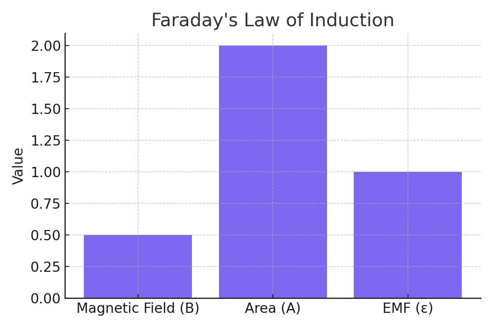

# Problem 1 – Electromagnetic Induction

## Problem Statement

A 5-turn circular coil of radius 0.1 m is placed in a uniform magnetic field perpendicular to its plane. The magnetic field increases from 0.1 T to 0.5 T in 2 seconds. Calculate the average induced emf in the coil.

---

## Given:

- Number of turns: \( N = 5 \)
- Radius: \( r = 0.1 \, \text{m} \)
- Initial magnetic field: \( B_i = 0.1 \, \text{T} \)
- Final magnetic field: \( B_f = 0.5 \, \text{T} \)
- Time: \( \Delta t = 2 \, \text{s} \)

---

## Formula:

Faraday’s Law of Electromagnetic Induction:

\[
\mathcal{E} = -N \cdot \frac{\Delta \Phi}{\Delta t} \quad \text{where} \quad \Phi = B \cdot A
\]

Area of circular coil:

\[
A = \pi r^2
\]

---

## Calculation:

\[
A = \pi (0.1)^2 = 0.0314 \, \text{m}^2
\]

\[
\Delta \Phi = B_f \cdot A - B_i \cdot A = (0.5 - 0.1) \cdot 0.0314 = 0.01256 \, \text{Wb}
\]

\[
\mathcal{E} = -5 \cdot \frac{0.01256}{2} = -0.0314 \, \text{V}
\]

---

## Final Answer:

The average induced emf in the coil is **0.0314 V** (magnitude).

---

## Visualization

Below is a graph showing the induced emf over time assuming constant speed and uniform field.

