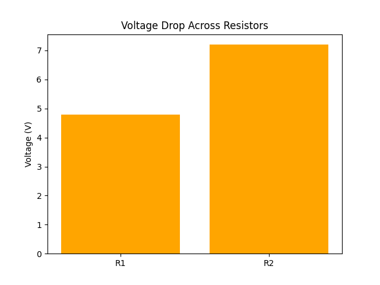

# Problem 5 – Kirchhoff’s Laws

## Problem Statement
A simple circuit has two resistors: R₁ = 2 Ω and R₂ = 3 Ω, and a battery of V = 12 V.  
Using Kirchhoff’s laws, calculate the current through each resistor and the voltage drop.

## Given:
- R₁ = 2 Ω  
- R₂ = 3 Ω  
- V = 12 V  

## Formulas:
- Ohm’s Law: V = I × R  
- Kirchhoff’s Voltage Law (KVL): Sum of voltage drops = Battery voltage  

## Calculation:
```math
Let I₁ = current through R₁  
Let I₂ = current through R₂  

Total Resistance, R_total = R₁ + R₂ = 2 + 3 = 5 Ω  
Total Current, I = V / R_total = 12 / 5 = 2.4 A  

Voltage drop across R₁ = I × R₁ = 2.4 × 2 = 4.8 V  
Voltage drop across R₂ = I × R₂ = 2.4 × 3 = 7.2 V  
```

## Visualization
Below is a graph showing the voltage drops across each resistor in the series:


