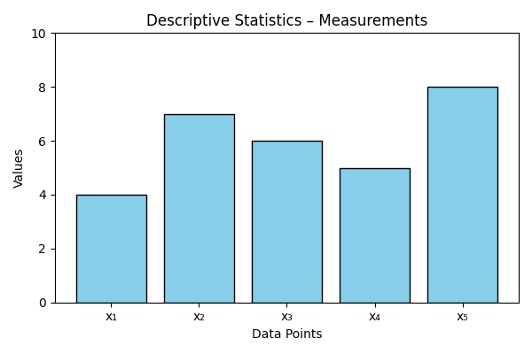

# Problem 6 – Descriptive Statistics

## Problem Statement
Given a dataset of five measurements: 4, 7, 6, 5, 8 — calculate the **mean**, **median**, and **mode**.

## Given:
- Dataset: 4, 7, 6, 5, 8

## Formulas:
- Mean: \( \bar{x} = \frac{\sum x_i}{n} \)
- Median: Middle value in ordered data
- Mode: Most frequent value

## Calculation:

$$
\text{Mean} = \frac{4 + 7 + 6 + 5 + 8}{5} = \frac{30}{5} = 6 \\
\text{Ordered data} = 4, 5, 6, 7, 8 \Rightarrow \text{Median} = 6 \\
\text{Each number occurs once} \Rightarrow \text{Mode} = \text{None}
$$

## Visualization

Below is a visualization of the dataset distribution:

