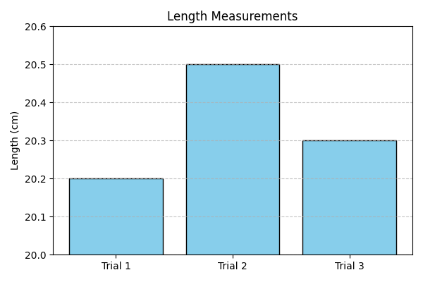

# Problem 8 – Uncertainty in Measurements

## Problem Statement

A student measures the length of a rod three times: 20.2 cm, 20.5 cm, and 20.3 cm.  
Calculate the average length and the uncertainty of the measurements.

---

## Given:

- Measurements: 20.2 cm, 20.5 cm, 20.3 cm

---

## Formulas:

- Average: \( \bar{x} = \frac{x_1 + x_2 + x_3}{3} \)
- Uncertainty: \( \Delta x = \frac{\text{max value} - \text{min value}}{2} \)

---

## Calculation:

Average:  
\[
\bar{x} = \frac{20.2 + 20.5 + 20.3}{3} = \frac{61.0}{3} = 20.33 \, \text{cm}
\]

Uncertainty:  
\[
\Delta x = \frac{20.5 - 20.2}{2} = \frac{0.3}{2} = 0.15 \, \text{cm}
\]

---

## Visualization

Below is a graphical representation of the measurements:

