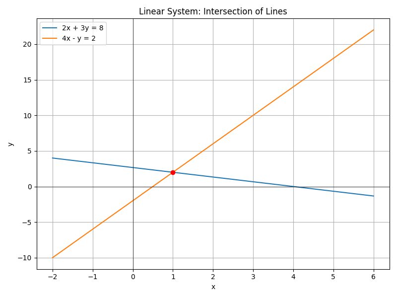

# Problem – Linear Algebra

## Problem Statement
Given a system of equations:
- 2x + 3y = 8  
- 4x - y = 2  

Solve using matrix methods.

## Matrices:
A = \begin{bmatrix}
2 & 3 \
4 & -1
\end{bmatrix},
\quad
b = \begin{bmatrix}
8 \
2
\end{bmatrix}

## Solution:
Using the inverse method:

x = A^{-1} b

yaml
Copy
Edit

## Visualization:
Below is a graphical representation of the solution space:

